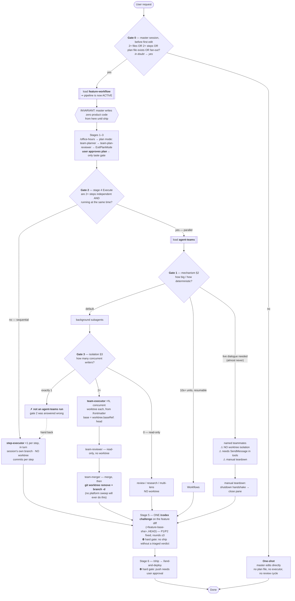

# Decision flow: who executes, and in what checkout

Every gate below is answered *before* the next layer loads. Each layer owns
exactly one decision and points at the next; no layer restates another's rule.

This file is a map, not a source of truth — the authoritative text lives in the
files named in the "Owned by" column. Keep it in sync when those change.

## Flow

## Gates

| Gate | Question | Owned by | Evaluated when |
|---|---|---|---|
| 0 | one-shot or pipeline? | `global/CLAUDE.md` → "Feature workflow" trigger | master session, before its first edit |
| 2 | sequential or parallel? | `skills/feature-workflow/SKILL.md` → "When to offer (lead only)" | stage 4, after plan approval |
| 1 | subagents / Workflows / teammates? | `skills/agent-teams/SKILL.md` §2 | after gate 2 answers "parallel" |
| 3 | worktree or not? | `skills/agent-teams/SKILL.md` §3 | after gate 1 answers "subagents" |

Gate 1 is numbered out of order on purpose: it is *inside* the parallel branch,
so gate 2 always precedes it. Gates fire 0 → 2 → 1 → 3.

## Leaf outcomes — every path terminates in exactly one

| # | Path | Executor | Worktree | Base branch | Who lands it | Who removes the worktree |
|---|---|---|---|---|---|---|
| L1 | gate 0 = no | master itself | no | session | master | n/a |
| L2 | gate 2 = sequential | `step-executor` ×1 per step | **no** | session | master | n/a |
| L3 | gate 3 = 2+ writers | `team-executor` ×N | **yes** (frontmatter) | `baseRef: head` | `team-merger` | `team-merger`, explicitly |
| L4 | gate 3 = read-only | ad-hoc subagents | no | session | n/a — nothing written | n/a |
| L5 | gate 1 = Workflows | workflow script agents | per script | per script | master | script / master |
| L6 | gate 1 = teammates | any, spawned named | **no — dropped** | session (shared!) | master | n/a — manual teardown |
| E1 | gate 3 = exactly 1 writer | — | — | — | — | redirects to **L2** |

## Invariants to check against

These are what a logic review should test. Each should hold on every path above.

1. **No two concurrent writers share a checkout.** Holds on L3 (worktree each).
   Vacuous on L1/L2/L4. **Violated by design on L6** — teammates share the lead's
   checkout, which is why L6 requires hand-partitioning files and is marked
   almost-never.
2. **Worktree ⟹ something explicitly removes it.** Holds on L3 only, via
   `team-merger`. Neither platform mechanism (no-change auto-removal, the
   `cleanupPeriodDays` sweep) ever fires on an executor worktree, because it has
   unpushed commits. Backstop for an aborted run: the lead's end-of-run check that no
   feature worktrees/branches remain.
3. **Worktree ⟹ it can see the plan file and prior work.** Requires
   `worktree.baseRef: "head"`. Under the default `"fresh"`, L3 breaks silently —
   executors get a clean `origin/main`.
4. **Isolation is never a per-spawn judgment call.** L3's worktree comes from
   `team-executor`'s frontmatter; L2 has no `isolation` field at all. The
   orchestrator picks an *agent*, not a flag. (This is the fix for the
   2026-08 audit: 11 of 22 executor spawns were worktree-isolated with no
   sibling writer in flight.)
5. **Every executor is named by the plan.** Global CLAUDE.md requires each plan
   step to name its subagent; L2 → `step-executor`, L3 → `team-executor`.
6. **Once the pipeline is active, the master writes no product code.** Applies
   from `LOAD` onward — L2 through L6. L1 is the only path where the master
   edits, and it is by definition outside the pipeline.
7. **Nothing ships without `/codex`, nothing pushes without the user.** Both
   paths converge on one challenge of the whole feature diff after the last
   step/merge.

## Known soft spots

- **Gate 0 is self-assessed and unenforced.** Nothing blocks a master that
  under-counts files from editing directly. Mitigated only by "in doubt, load
  it". This is the weakest link in the chain.
- **E1 is a detected-late error, not a prevented one.** By the time gate 3 sees
  one writer, gate 2 has already committed to the parallel path. The redirect
  works, but the wasted step is real.
- **Gate 2's "at the same time" is a prediction.** A plan that looks parallel
  can serialize in practice (units colliding on a hub file — observed twice in
  the audit). §3's mitigation is to give a hub file to one unit and prefer
  fewer, larger units.
- **L6 violates invariant 1 by construction** and is retained only for live
  dialogue. Every other property it needs (contracts, approvals) is available on
  L3 without the violation.
